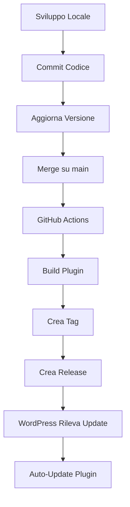

# 🚀 Deploy Automatico del Plugin da GitHub a WordPress

Questa guida spiega come configurare il deploy automatico del plugin WordPress **FP Privacy and Cookie Policy** da GitHub al tuo sito WordPress.

## 📋 Indice

1. [Come Funziona](#come-funziona)
2. [Configurazione GitHub (✅ Già Fatto)](#configurazione-github)
3. [Configurazione WordPress](#configurazione-wordpress)
4. [Come Aggiornare il Plugin](#come-aggiornare-il-plugin)
5. [Troubleshooting](#troubleshooting)

---

## 🔄 Come Funziona

Il sistema di deploy automatico funziona in questo modo:

1. **Merge su GitHub**: Quando fai un merge sul branch `main` (o quando crei un tag manualmente)
2. **Build Automatico**: GitHub Actions compila automaticamente il plugin
3. **Creazione Release**: Viene creata una release su GitHub con il file ZIP del plugin
4. **Notifica WordPress**: WordPress riceve la notifica dell'aggiornamento disponibile
5. **Auto-Update**: Il plugin si aggiorna automaticamente sul tuo sito (se configurato)

```
┌─────────────┐      ┌──────────────┐      ┌────────────┐      ┌───────────────┐
│   Merge su  │ ───> │ GitHub       │ ───> │  Release   │ ───> │  WordPress    │
│   GitHub    │      │ Actions      │      │  Creata    │      │  Auto-Update  │
└─────────────┘      └──────────────┘      └────────────┘      └───────────────┘
```

---

## ✅ Configurazione GitHub (Già Fatto)

Il repository è già configurato con:

### 1. Header del Plugin

Nel file `fp-privacy-cookie-policy.php` sono stati aggiunti gli header necessari:

```php
* GitHub Plugin URI: franpass87/FP-Privacy-and-Cookie-Policy
* Primary Branch: main
* Release Asset: true
* Requires PHP: 7.4
* Requires at least: 5.8
```

### 2. GitHub Actions Workflow

Il workflow `.github/workflows/build-zip.yml` è configurato per:

- ✅ Compilare il plugin quando fai merge su `main`
- ✅ Creare automaticamente un tag basato sulla versione nel plugin
- ✅ Generare una GitHub Release con il file ZIP
- ✅ Allegare il plugin compilato alla release

### 3. Trigger Automatici

Il workflow si attiva automaticamente quando:

- Fai un **push** sul branch `main` (dopo un merge)
- Crei manualmente un **tag** (es. `v0.1.2`)
- Fai una **pull request** (solo build, senza release)

---

## 🔧 Configurazione WordPress

Per ricevere gli aggiornamenti automatici su WordPress, devi installare uno di questi plugin:

### Opzione 1: Git Updater (Raccomandato) 🌟

**Git Updater** è un plugin gratuito e open-source che permette a WordPress di ricevere aggiornamenti da GitHub.

#### Installazione:

1. **Scarica Git Updater**:
   - Vai su [GitHub - Git Updater](https://github.com/afragen/git-updater)
   - Scarica l'ultima release: [Download](https://github.com/afragen/git-updater/releases/latest)

2. **Installa su WordPress**:
   - Vai su **Plugin → Aggiungi nuovo → Carica plugin**
   - Carica il file ZIP di Git Updater
   - Attiva il plugin

3. **Configura per Repository Pubblici**:
   - Il plugin rileverà automaticamente l'header `GitHub Plugin URI` nel tuo plugin
   - Non serve configurazione aggiuntiva per repository pubblici

4. **Per Repository Privati** (opzionale):
   - Vai su **Impostazioni → Git Updater → Impostazioni**
   - Aggiungi un **GitHub Personal Access Token**:
     1. Vai su GitHub → Settings → Developer settings → Personal access tokens
     2. Genera un nuovo token (classic) con scope `repo`
     3. Copia il token e incollalo in Git Updater

#### Configurazione Auto-Update:

1. Vai su **Plugin → Plugin installati**
2. Trova **FP Privacy and Cookie Policy**
3. Attiva **"Abilita aggiornamenti automatici"**

Ora ogni volta che crei una release su GitHub, WordPress rileverà l'aggiornamento e lo installerà automaticamente!

---

### Opzione 2: WP Pusher (Alternativa)

**WP Pusher** è un servizio (con piano gratuito limitato) che offre funzionalità simili.

#### Installazione:

1. Vai su [WP Pusher](https://wppusher.com/)
2. Scarica il plugin
3. Installa e attiva su WordPress
4. Configura il repository GitHub nel dashboard di WP Pusher

---

## 🔄 Come Aggiornare il Plugin

### Metodo 1: Merge Automatico (Raccomandato)

Quando sei pronto per rilasciare una nuova versione:

1. **Aggiorna la versione** nel file `fp-privacy-cookie-policy.php`:
   ```php
   * Version: 0.1.2
   ```
   
   E nella costante:
   ```php
   define( 'FP_PRIVACY_PLUGIN_VERSION', '0.1.2' );
   ```

2. **Fai commit e merge** sul branch `main`:
   ```bash
   git add fp-privacy-cookie-policy/fp-privacy-cookie-policy.php
   git commit -m "Bump version to 0.1.2"
   git push origin main
   ```

3. **Automaticamente**:
   - GitHub Actions compilerà il plugin
   - Creerà il tag `v0.1.2`
   - Pubblicherà la release su GitHub
   - WordPress rileverà l'aggiornamento (entro 12 ore)

### Metodo 2: Tag Manuale

Se preferisci creare il tag manualmente:

```bash
git tag -a v0.1.2 -m "Release version 0.1.2"
git push origin v0.1.2
```

GitHub Actions creerà automaticamente la release.

---

## 🔍 Verificare che Funzioni

### 1. Controlla GitHub Actions

Dopo un merge/push:
1. Vai su GitHub → **Actions**
2. Dovresti vedere il workflow **"Build plugin ZIP"** in esecuzione
3. Attendere che completi con successo (✅)

### 2. Controlla le Release

1. Vai su GitHub → **Releases**
2. Dovresti vedere la nuova versione (es. `v0.1.2`)
3. Il file ZIP del plugin dovrebbe essere allegato

### 3. Controlla WordPress

1. Vai su **Dashboard → Aggiornamenti**
2. Oppure **Plugin → Plugin installati**
3. Dovresti vedere l'aggiornamento disponibile per **FP Privacy and Cookie Policy**

⚠️ **Nota**: Git Updater controlla gli aggiornamenti ogni 12 ore. Per forzare un controllo immediato:
- Vai su **Dashboard → Aggiornamenti → Controlla di nuovo**

---

## 🛠 Troubleshooting

### Il plugin non rileva aggiornamenti

**Soluzione**:
1. Verifica che Git Updater sia installato e attivo
2. Vai su **Impostazioni → Git Updater → Debug**
3. Controlla che il plugin sia nell'elenco
4. Forza un refresh: **Dashboard → Aggiornamenti → Controlla di nuovo**

### La release non viene creata

**Soluzione**:
1. Verifica che il workflow GitHub Actions sia completato con successo
2. Controlla i log del workflow per errori
3. Assicurati che la versione nel plugin sia stata aggiornata

### Il tag esiste già

Se hai già creato un tag con quella versione:
1. Elimina il vecchio tag:
   ```bash
   git tag -d v0.1.2
   git push origin :refs/tags/v0.1.2
   ```
2. Oppure incrementa la versione a `0.1.3`

### Repository privato non funziona

Per repository privati, devi:
1. Creare un GitHub Personal Access Token
2. Aggiungerlo in Git Updater: **Impostazioni → Git Updater → GitHub Access Token**

---

## 📊 Workflow Completo



---

## 📝 Checklist Rapida

Prima di ogni release:

- [ ] Testato il plugin in locale
- [ ] Aggiornato numero di versione in `fp-privacy-cookie-policy.php` (header e costante)
- [ ] Aggiornato `CHANGELOG.md` (se presente)
- [ ] Fatto commit e merge su `main`
- [ ] Verificato che GitHub Actions sia completato
- [ ] Verificato che la release sia stata creata
- [ ] (Opzionale) Controllato l'aggiornamento su WordPress

---

## 🎯 Vantaggi di Questo Setup

✅ **Zero configurazione manuale**: Una volta configurato, tutto è automatico  
✅ **Versionamento automatico**: La versione nel plugin determina il numero di release  
✅ **Tracciabilità**: Ogni release è collegata a un commit specifico  
✅ **Sicurezza**: Solo i merge sul main branch creano release  
✅ **Semplicità**: Basta fare merge per deployare  

---

## 🔗 Link Utili

- [Repository GitHub](https://github.com/franpass87/FP-Privacy-and-Cookie-Policy)
- [Git Updater Plugin](https://github.com/afragen/git-updater)
- [GitHub Actions Documentation](https://docs.github.com/en/actions)
- [WordPress Plugin Header Documentation](https://developer.wordpress.org/plugins/plugin-basics/header-requirements/)

---

**Ultimo aggiornamento**: 2025-10-10
